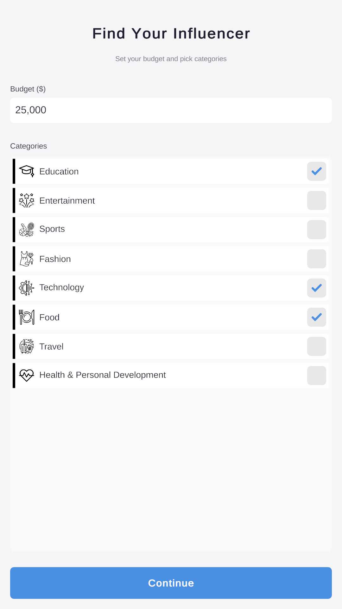
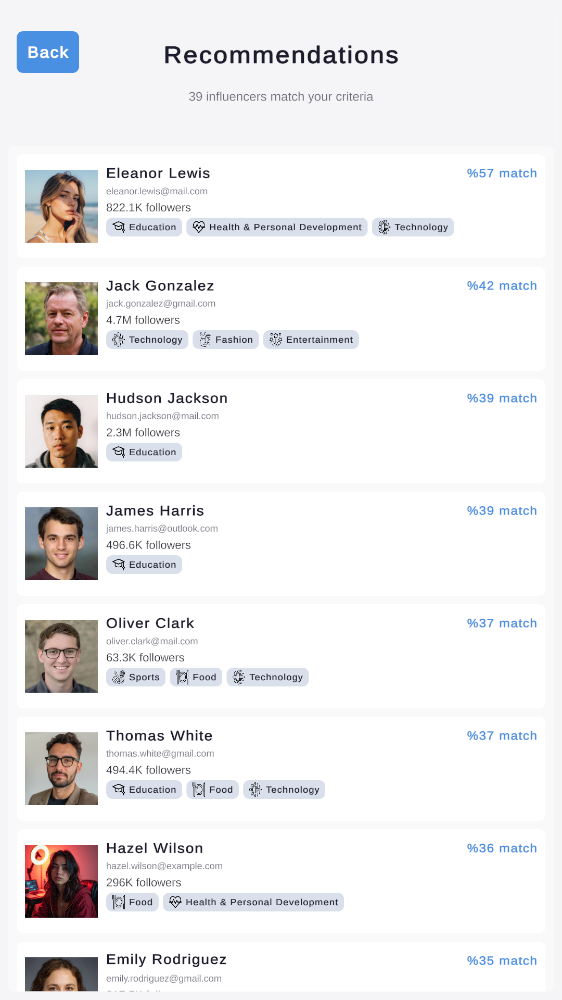
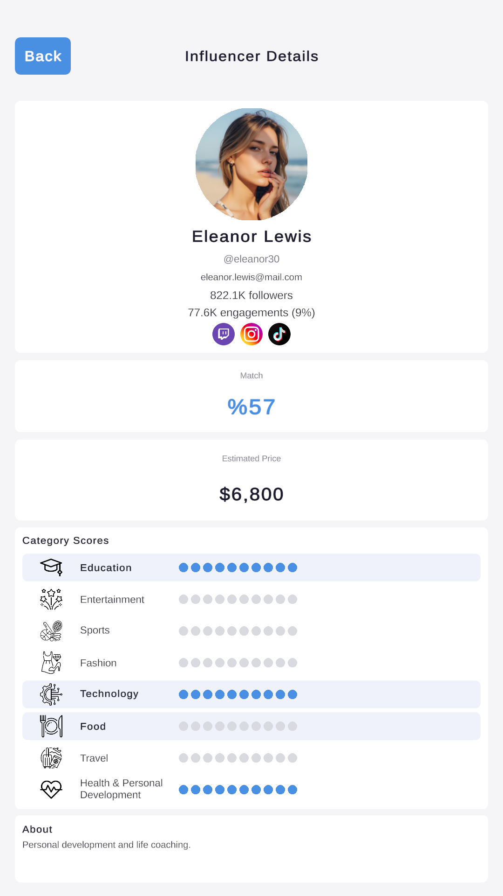

# Influencer Match

A Unity 6 mobile application that ranks 100 fictional influencers against a user-defined marketing budget and category preference using deterministic hybrid scoring. No backend — all data is authored as `ScriptableObject` assets and loaded through Unity Addressables on scene entry.

## User Flow

- A Splash screen displays for a fixed dwell, then transitions to the Main Menu.
- The Main Menu prompts the user to start a matching session.
- In the Main view the user enters a marketing budget and toggles one or more category preferences.
- Submitting the form opens a ranked list of recommended influencers — each card shows compatibility percentage, follower count, and pricing.
- Tapping a card opens the influencer detail panel with a full breakdown: compatibility tier, per-category score bars, the pricing math, the influencer's engagement count (followers × engagement rate — a 50K follower / 50% rate creator beats a 100K / 10% one), and brand-colored icons for their active social platforms (Instagram, YouTube, TikTok, X, Twitch).
- If no influencer meets the minimum threshold, an empty-state panel surfaces with a Change Filters action.

## Categories

| Category | Domain |
|---|---|
| Education | Teaching, e-learning, study content |
| Entertainment | Comedy, vlogs, lifestyle |
| Sports | Athletics, fitness, sports analysis |
| Fashion | Clothing, accessories, style |
| Technology | Reviews, tutorials, gadgets |
| Food | Recipes, cooking, restaurant reviews |
| Travel | Destinations, travel tips, photography |
| Health & Personal Development | Wellness, productivity, self-improvement |

Users may select one or multiple categories. The matching algorithm averages the influencer's per-category score across the selected categories — a zero counts toward the mean, so an influencer untrained in any selected category is penalized.

## Matching Algorithm

Each influencer is scored deterministically:

```
hybrid_score = categoryWeight   * normalize(avg_category_score)
             + followersWeight  * normalize(followers, min_followers, max_followers)
             + engagementWeight * engagement_rate

final_score  = is_over_budget ? hybrid_score * over_budget_penalty
                              : hybrid_score
```

| Term | Default | Authored In |
|---|---|---|
| `CategoryWeight` | 0.5 | `MatchingConfig` |
| `FollowersWeight` | 0.3 | `MatchingConfig` |
| `EngagementWeight` | 0.2 | `MatchingConfig` |
| `OverBudgetPenalty` | 0.5 | `MatchingConfig` |

Constraint: `CategoryWeight + FollowersWeight + EngagementWeight = 1.0`, enforced at edit time by a custom Inspector on `MatchingConfig`.

Follower-count normalization is linear between authored min and max bounds. Engagement rate is already in `[0, 1]`. Category score is the mean of the user's selected categories, divided by the maximum raw score and clamped to `[0, 1]`.

Tie-breaking is deterministic: `final_score` DESC, then `GUID` ASC. The same input always produces the same ranking — useful for snapshot tests.

## Pricing

```
final_price = base_price
            * category_score_multiplier(avg_category_score)
            * follower_tier_multiplier(followers)
```

Both multipliers are tiered lookup tables in `MatchingConfig`, edited via the Inspector. The Detail panel surfaces the final price; the multiplier breakdown is internal to the pricing service and exercised in EditMode tests.

## Architecture

Three-scene flow, 2-scope VContainer DI, dual-pipe signal bus.

```
SplashController (dwell complete)
  -> ProjectPipe: SplashCompletedMessage
    -> AppNavigationController
      -> SceneLoader.LoadAsync("Scene/MainMenu")

MainMenuView (Match Influencer clicked)
  -> ProjectPipe: MatchInfluencerRequestedMessage
    -> AppNavigationController
      -> SceneLoader.LoadAsync("Scene/Main")
        -> MainInstaller.InstallBindings
          -> MainDataInstaller (Addressables WaitForCompletion)
          -> Feature installers register views + controllers
        -> PanelNavigationController.Start
          -> UIManager.Show<BudgetCategoryInputView>

BudgetCategoryInputView (Continue clicked)
  -> MainPipe: BudgetCommittedMessage
    -> RecommendationListController
      -> Presenter.Build -> RecommendationListViewModel
      -> if ResultCount == 0:
           MainPipe: EmptyStateRequestedMessage
           -> PanelNavigationController -> UIManager.Show<EmptyStateView>
         else:
           UIManager.Show<RecommendationListView>
           View.DisplayResults

RecommendationListView (card clicked)
  -> MainPipe: CardSelectedMessage(InfluencerId)
    -> InfluencerDetailController
      -> Presenter.Build(InfluencerId) -> InfluencerDetailViewModel
      -> UIManager.Show<InfluencerDetailView>

InfluencerDetailView / EmptyStateView (Back clicked)
  -> MainPipe: BackRequestedMessage
    -> PanelNavigationController
      -> UIManager.GoBack
```

See [`docs/ARCHITECTURE.md`](docs/ARCHITECTURE.md) for the full design — DI scope rationale, signal pipe boundary rules, feature module pattern, domain layer purity, and conventions.

## Asset Loading

Unity Addressables manages scene loading and the heavy data assets:

| Group | Addresses | Loaded By |
|---|---|---|
| Scenes | `Scene/MainMenu`, `Scene/Main` | `SceneLoader.LoadAsync` (per navigation) |
| Data | `Data/SplashConfig`, `Data/UISharedConfig`, `Data/ScreenFaderConfig` | `UIConfigInstaller` (Boot scope, released at app shutdown) |
| Data | `Data/InfluencerDatabase`, `Data/CategoryConfig`, `Data/MatchingConfig`, `Data/BudgetConfig`, `Data/RecommendationConfig`, `Data/ScoreBarConfig`, `Data/PlatformConfig` | `MainDataInstaller` (Main scope, released on Main scene exit) |

Every authored asset goes through Addressables — there are no direct `[SerializeField]` config references on either installer. Splash + UISharedConfig stay in Boot scope because UIPanelBase / UIButtonPressFeedback need them in every scene; everything else lives Main-only and is freed on scope dispose.

Splash stays in Build Settings as the bootstrap scene.

The avatar `SpriteAtlas` (~16–30 MB) is referenced by `InfluencerDatabase`. Loading the database via Addressables in the Main scope means the atlas is resident **only when Main is active**. `AddressableHandleRegistry` releases every tracked `AsyncOperationHandle` on scope dispose, freeing the atlas when Main unloads.

| Scene | Atlas Resident? |
|---|---|
| Splash | ❌ |
| MainMenu | ❌ |
| Main | ✅ |

## Signal Bus

Cross-feature coordination is mediated by [GenericEventBus](https://github.com/PeturDarri/GenericEventBus), split into two pipes scoped to two DI scopes:

| Pipe | DI Scope | Signals |
|---|---|---|
| ProjectPipe | BootLifetimeScope | `SplashCompletedMessage`, `MatchInfluencerRequestedMessage` |
| MainPipe | MainLifetimeScope | `BudgetCommittedMessage`, `CardSelectedMessage`, `BackRequestedMessage`, `EmptyStateRequestedMessage` |

Feature controllers never reach into a sibling feature's view directly — every cross-feature show or back navigation is a typed `ISignal` on the bus. Signals are `readonly struct` with public readonly fields only.

## Interaction & Animation

Modern mobile feedback layered through DOTween + UniTask — no coroutines, no `Mathf.Lerp` in `Update`.

| Surface | Animation | Implementation |
|---|---|---|
| Every UI Button | Press-down scale to `0.95` on `PointerDown`, restore on release; skipped when `Button.interactable == false` | `UIButtonPressFeedback` (`IPointerDown`/`Up`/`Exit` explicit interface impl, attached per Button via editor tool) |
| Category toggle | `DOPunchScale(0.08, 0.18s)` haptic bounce on `Toggle.onValueChanged` | `CategoryToggleView.PlayBounce` |
| Recommendation card | `DOPunchScale` on click, awaits completion, then raises `CardClicked` | `InfluencerCardView.HandleClickButtonClicked` |
| Card list spawn | `UniTask.Delay(StaggerDelay)` between cards + per-card `CanvasGroup.DOFade(0 → 1)` | `RecommendationListView.SpawnCardsStaggeredAsync` |
| Panel entrance | `CanvasGroup.DOFade(0 → 1)` on every `IUIPanel.Show` | `UIPanelBase.PlayEntranceFade` |
| Splash title / subtitle | Staggered `TMP_Text.DOFade` with offset delay | `SplashView.Start` |
| Budget validation error | `RectTransform.DOShakeAnchorPos(0.3s, x: 10px)` on `ShowError(non-null)` | `BudgetCategoryInputView.PlayBudgetInputShake` |

All tweens are linked to their owner GameObject via `.SetLink(gameObject)`; staggered async spawning honours `destroyCancellationToken` to abort in-flight loops on scene unload. Animation values follow the project's feature-config convention — `RecommendationConfig` (card spawn / fade / tap punch), `BudgetConfig` (toggle bounce / validation shake), `UISharedConfig` (panel fade / button press — genuinely cross-cutting framework concerns). No hardcoded animation constants in interaction components.

## Editor Tooling

Two custom editor windows + three custom Inspectors + one PropertyDrawer share a single `EditorStyleCache` for visual consistency.

- **Config Manager Window** — enumerates every `ScriptableObject` that implements `IVisibleConfig`, grouped by Category, with the selected config's Inspector embedded inline.
- **Influencer Database Window** — master-detail editor for the 100-record database. Searchable, sortable, with avatar thumbnails rendered correctly from the `SpriteAtlas` via `sprite.textureRect`-mapped `GUI.DrawTextureWithTexCoords`. Two-stage confirmation for destructive bulk operations.
- **EditorStyleCache** — lazy-initialized GUIStyles + palette + 4/8/12/16/24 spacing grid. Eliminates per-`OnGUI` GUIStyle and `Texture2D` allocations; resources released on assembly reload via `AssemblyReloadEvents.beforeAssemblyReload`.

## Tests

EditMode (pure C#, sub-second total):

- `MatchingService.Rank` — determinism + tie-break order
- `PricingService.Calculate` — edge cases (empty categories, zero budget)
- Presenter view-model construction
- `InfluencerDatabase.TryFindById` lookups
- `MatchingConfig` / `CategoryConfig` Inspector validation rules

PlayMode (scene + Unity objects required):

- View ↔ controller binding (events fire, state updates propagate to UI)
- Recommendation list object pooling lifecycle
- Screen fader transition timing
- Safe-area math against simulated notch insets

## Tech Stack

| | |
|---|---|
| Engine | Unity 6.3 (URP, portrait, new Input System) |
| DI | VContainer (2-scope) |
| Event Bus | GenericEventBus (dual-pipe) |
| Async | UniTask |
| Tween | DOTween |
| Asset Streaming | Unity Addressables 2.3 |
| Pattern | MVP (Model–View–Presenter) |
| Testing | NUnit (EditMode + PlayMode) |

## Documentation

- [Architecture](docs/ARCHITECTURE.md) — Layer model, DI scope rationale, signal pipe boundaries, feature module pattern, conventions, known trade-offs

## Screenshots

| Budget Input | Recommendations | Detail |
|---|---|---|
|  |  |  |

## How to Run

1. Clone the repository.
2. Open the project with **Unity 6000.3.9f1** (Unity 6.3).
3. Open `Assets/Final/Runtime/Scenes/Splash.unity`.
4. Press Play.

For player builds, run **Window > Asset Management > Addressables > Groups → Build > New Build → Default Build Script** before building — the runtime depends on the generated content catalog.

## Tested On

- Unity Editor (Play Mode, 6000.3.9f1)

## License

This project is for demonstration purposes — built as an undergraduate graduation project (2026).
